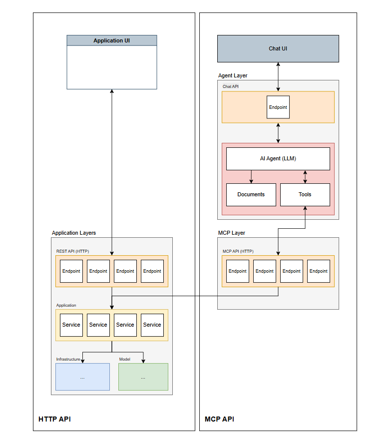

# dotnet-template

**dotnet-template** is an ASP.NET CORE C# template for building traditional HTTPS APIs and MCP (Model Context Protocol) APIs. It follows Clean Architecture and Clean Code best practices by using IoC, DI, and more... Built-in authorization workflow with OAuth JWT tokens or/and MS Entra ID.

## Prerequisites:

- .NET 10 SDK installed.

- [OPTIONAL] If using VSCode IDE install ".NET Install Tool", "C#" and "C# DEV Kit" recommended extensions. Please use Microsoft official extensions. 

## Architecture

**dotnet-template** C# solution is composed of 5 different layers:

- Domain Layer
- Application Layer
- Infrastructure Layer
- API Layer
- MCP Layer



> For more information on clean architecture revisit "*docs/clean-architecture.md*" file

The advantages of integrating the MCP layer within the same dotnet project as the conventional API has a major advantage: 

- Application Services are reused, compiled, and bundled into the MCP server artifacts, reducing resource consumption by avoiding network overhead and extra bandwidth from API calls since application services also run within the MCP server. While this increases the bundle size, the impact on backend applications is not specially important.

Moreover, MCP can be configured as well in the same layer as the HTTPS API. This way you can deploy them together saving resources depending on your VPS and Cloud configuration. However, the recommended approach based on "modelcontextprotocol/csharp-sdk" best practices is to separate these APIs into different layers, if you manage accordingly your cloud configuration no extra costs should be incurred.

## Instructions

0. Set your preferred ASPNETCORE environment.

    i.e.: Windows PowerShell
    ```ps
    $env:ASPNETCORE_ENVIRONMENT="Local"
    ```

    i.e.: Windows Cmd
    ```cmd
    set ASPNETCORE_ENVIRONMENT=Local
    ```

    i.e.: Linux Bash
    ```bash
    export ASPNETCORE_ENVIRONMENT=Local
    ```

1. Apply your application settings and MS Entra ID configuration to *appsettings.{env}.json* file. By default *appsettings.json* is used unless you specify and environment.

```json
{
  "Logging": {
    "LogLevel": {
      "Default": "Information",
      "Microsoft.AspNetCore": "Warning"
    }
  },
  "ApplicationSettings": {
    "AzureAd": {
      "Instance": "https://login.microsoftonline.com/",
      "ClientId": "...",
      "TenantId": "...",
      "Audience": "api://..."
    },
    "ServerUrl": "https://localhost:8443",
    "McpServerUrl": "https://localhost:9443",
    "DatabaseSecretArn": "arn:aws:secretsmanager:region:<account-id>:secret:<secret-name>"
  },
  "AllowedHosts": "*"
}
```

2. Build all projects within the solution

    ```bash
    cd dotnet-template/src
    dotnet build
    ```

3. Execute HTTPS and MCP APIs

    2.1. Run the HTTPS API

    ```bash
    dotnet run --project dotnet-template/src/API/API.csproj
    ```

    2.2. Run the MCP API

    ```bash
    dotnet run --project dotnet-template/src/MCP/MCP.csproj
    ```

## Debugging Instructions

You can debug both HTTPS and MCP APIs using VSCode and Visual Studio 2022 or greater.

- VSCode:
    - Execute VSCode debugger with "*.vscode/launch.json*" configurations. Use "HTTPS API" and/or "MCP API".
    - Execute VSCode debugger with "*Properties/launchSettings.json*" project configurations. You will need to install ".NET Install Tool", "C#" and "C# DEV Kit" VSCode extensions.


- Visual Studio 2022 or greater:
    - Execute Visual Studio debugger using "*Properties/launchSettings.json*" project configurations.

## Emulating MCP calls

1. Run https MCP project

2. Run MCP Inspector

    ```bash
    $env:NODE_TLS_REJECT_UNAUTHORIZED=0
    npx @modelcontextprotocol/inspector
    ```

3. Connect to MCP server through MCP Inspector

    ```bash
    Streamable HTTP: https://localhost:9433/mcp
    ```

- Please specify an **Authorization** header if using JWT and MS Entra ID authorization. 

    ```http
    "Authorization": "Bearer eyJ0eXAiOiJKV1Q..."
    ```

## Connecting MCP to GitHub Copilot Agent

To connect your GitHub Copilot Agent to your MCP tools, please specify the MCP server configuration and its URL within "*.vscode/mcp.json*" file.

\* Take into account the MCP URL, the MCP underlying protocol (HTTP, SSE, Stdio), authorization and any additional header your may use.

```json
{
	"servers": {
		"todos": {
			"url": "https://localhost:9443/mcp",
			"type": "http",
		}
	},
	"inputs": [],
}
```